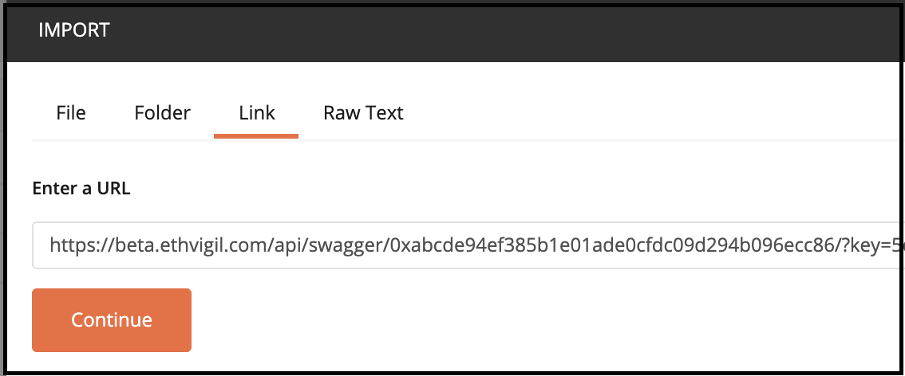
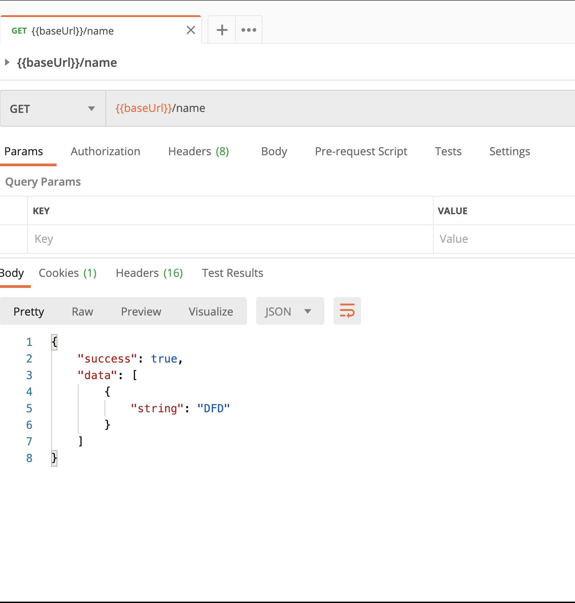
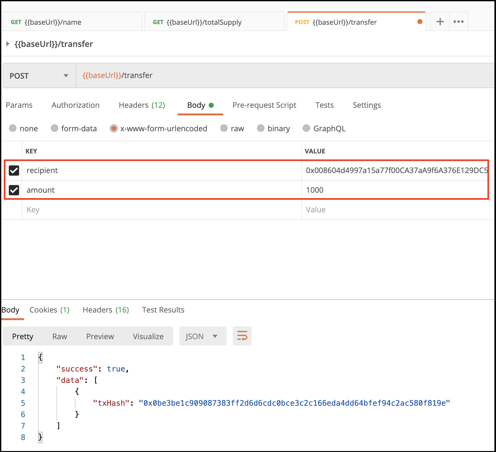
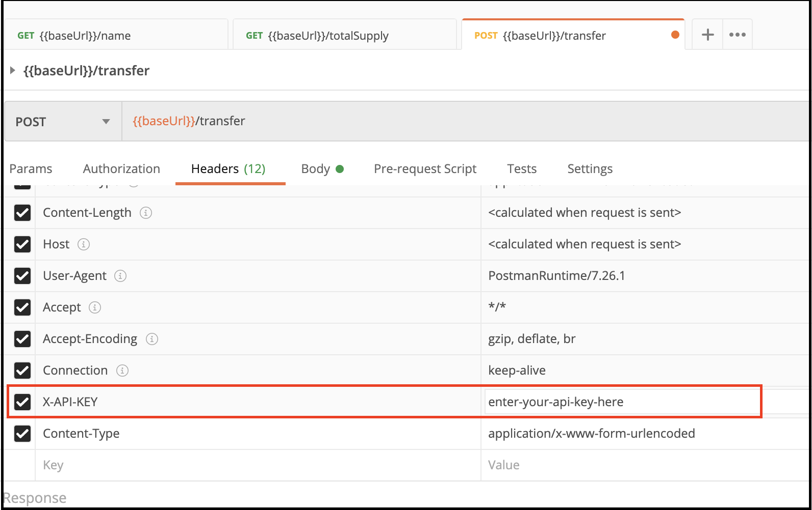
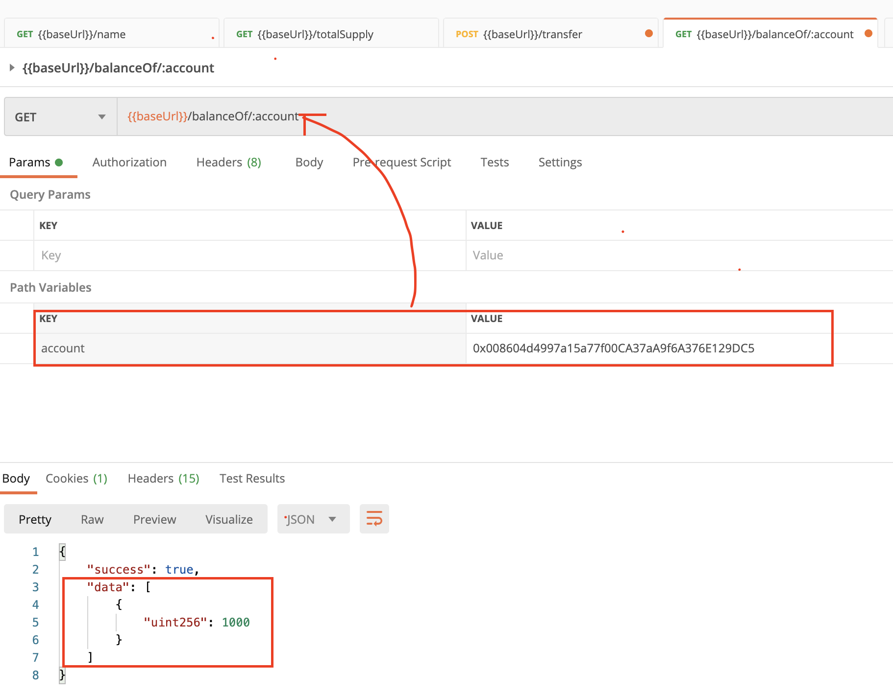

## Prerequisites
You are familiar with deploying contracts [via the CLI tool](cli_gettingstarted.md) or [the web frontend](web_gettingstarted.md).

## OpenAPI Specification
Once you deploy a contract via EthVigil, we automatically generate REST API endpoints over HTTPS which are available as an [OpenAPI Specification](https://swagger.io/specification/).

### Get the OpenAPI spec link
#### With the CLI tool
```
ev-cli getoas 0xbbd8cda5503e1df2983f738ad131a2304528e3dd

https://beta.ethvigil.com/api/swagger/0xbbd8cda5503e1df2983f738ad131a2304528e3dd/?key=80340b2a-633b-4a33-898c-06055ee10a34
```
The contract being used for this guide comes bundled with the CLI tool by the name `token.sol` and follows the standard implementation of an [ERC20 token contract](https://theethereum.wiki/w/index.php/ERC20_Token_Standard).

### Import the OpenAPI spec in Postman

Click on the import button in the top left corner and select `Import from link`



You will see the Contract methods populated as HTTP GET and POST endpoints.


### GET HTTP endpoints

EthVigil exposes the following as GET endpoints from the Solidity source code of a smart contract
* any `public` variable
* any `public` method that does not alter the state of the contract i.e. ***[`stateMutability` is `pure` or `view`](https://solidity.readthedocs.io/en/v0.5.10/abi-spec.html#json)***

Let us try out a couple of GET calls on the contract that reads the state data on chain.

**Beginning with the public variable `name`**, EthVigil automatically exposes it as a GET endpoint as if it was an accessor.

Relevant Solidity code in `token.sol`:
```
string public  name;
```



**Finding out the total supply of this ERC20 contract**


This tells us the total tokens in supply through this contract amounts to 1000000000000000000000000.

### POST HTTP endpoints

EthVigil exposes the following as POST endpoints from the Solidity source code of a smart contract

* any `public` method that does not alter the state of the contract i.e. ***[`stateMutability` is `payable` or `nonpayable`](https://solidity.readthedocs.io/en/v0.5.10/abi-spec.html#json)***

**We will now invoke the famed `transfer()` method on the contract.**
The request body is already populated with the necessary parameters, courtesy the tight integration between Postman and OpenAPI Specs.



**To perform POST calls on EthVigil API, an HTTP header `X-API-KEY` is also expected.**



>Referring back to the section on [Subscribing to events on a contract](cli_gettingstarted.mod#subscribe-to-the-transfer-and-approval-events-on-the-contract), there was a webhook endpoint already registered to listen to a `Transfer` event

**Once entering the necessary body and header request parameters, we complete the HTTP POST to `transfer()`**


It returns the transaction hash sent out on the blockchain network corresponding to this request, which is, `0x532c587a2e24f481f73b58858a5849cd2247e2df324f17780a818a7e13f50436`

### Verifying the state changes

We make a call to the public mapping `balanceOf` on the ERC20 smart contract that holds a mapping of Ethereum addresses to their allocated tokens.



### Verifying the event data payload

The `transfer()` method emits a `Transfer` event which holds necessary information about the call in [*event log topics*](https://media.consensys.net/technical-introduction-to-events-and-logs-in-ethereum-a074d65dd61e).

Checking back on our registered webhook endpoint, we see we have received the following payload:


